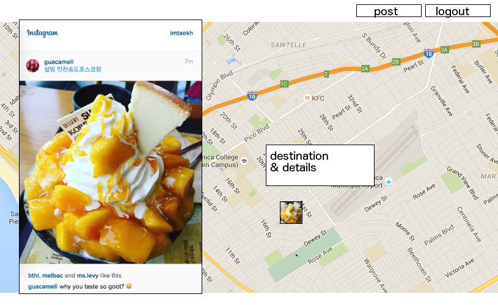

# iBalloon
"A new way to enjoy instagram!"

"Let's fly your Instagram pictures to places all over the world!"

## Logo

## Features
* You can pick a picture from your Instagram and set a destination.
* The picture you choose will slowly(about 10 miles per hour) moving to the destination on the map.
* You can also see other users' traveling pictures and messages. feel free to like them if you like it!

## Usage
* Send a food picture back to the restaurant you went last night to show the excellent experience you had.
* Send a picture with a nice message to a candidate you support.
* Send a picture you took with your favorite animal at a zoo, back to him/her to show how much you love him/her

## Wire frame

## Technology
* Full MEAN Stack(MongoDB, Express, AngularJS, NodeJS)
* Instagram API
* Google map API
